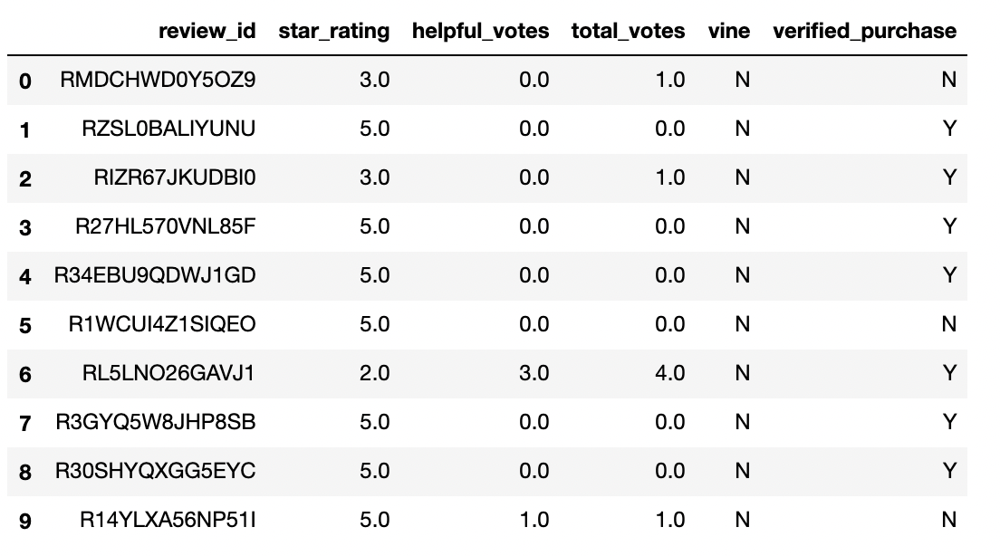
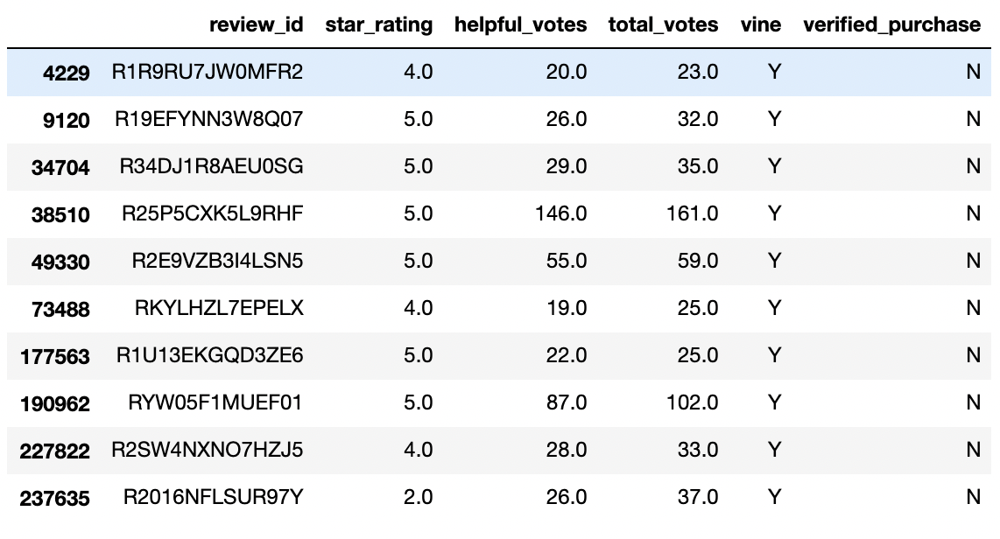
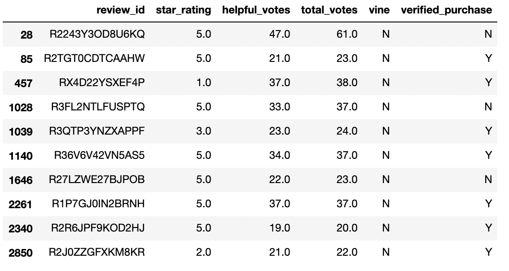

# Amazon Vine Analysis

## Overview

The Amazon Vine program is a "service that allows manufacturers and publishers receive reviews for their products" whereby companies "pay a small fee to Amazon and provide products to Amazon Vine members, who are then required to publish a review." The following analysis examines the star ratings given by Vine and non-Vine members as part of reviews for musical instruments to determine whether there is bias towards positive reviews among Vine members. 

## Results

The original dataset contained a total of 904,765 reviews of musical instruments. The first ten entries in this dataset are shown below: 

This dataset was refined by excluding reviews with less than 20 total votes and those with less than 50% helpful votes (hopeful votes/total votes). From here the reviews were broken down into Vine members and non-Vine members. 

### Vine Members

* There were a total of 60 reviews by Vine members. 
* 34 of those reviews were 5-star reviews. 
* The percentage of reviews that were 5-star was 56.67%. 

The first ten reviews by Vine members are shown below: 

### Non-Vine Members

* There were 14,477 reviews by non-Vine members.
* 8,212 of those reviews were 5-star reviews.
* The percentage of reviews that were 5-star was 56.72%. 

The first ten reviews by non-Vine members are shown below:

## Summary

Based on the results above, it can be suggested that there is no positive bias among Vine members. In fact, the proportion of 5-star reviews is slightly lower among Vine members than non-Vine members (56.67% vs 56.72%). Further analyses to confirm these results could include analyzing 1-star reviews for both groups, or by repeating the analysis above on the unfiltered dataset. Completing this analysis with reviews of other product types could also lend confidence to this analysis, especially on a dataset that includes more reviews by Vine members, as only 60 were included in the filtered dataset used in this analysis. 
